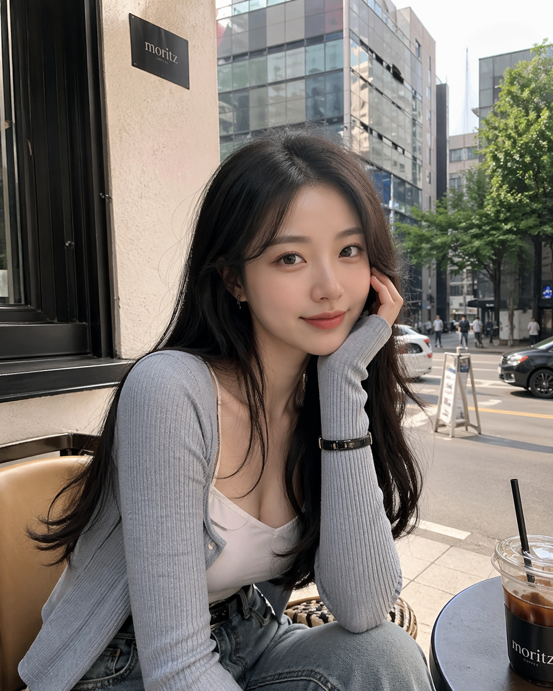
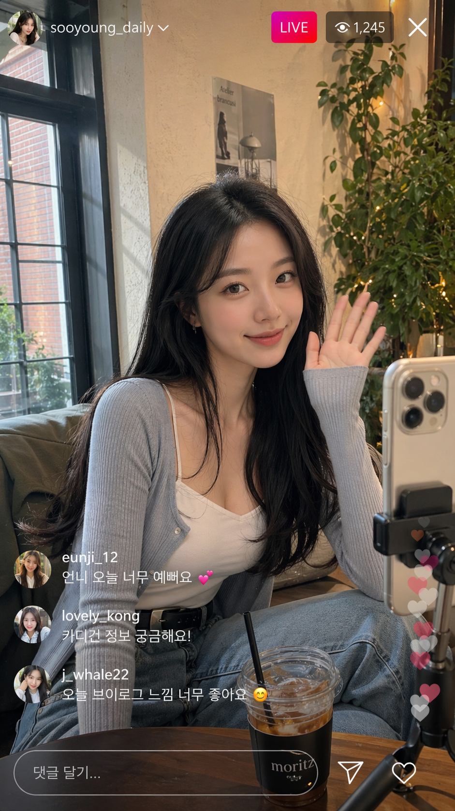
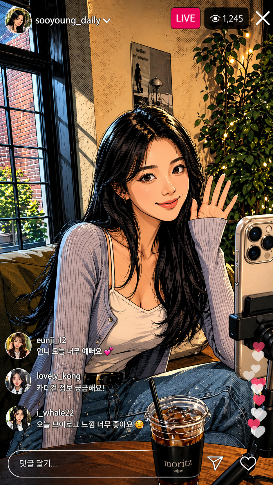
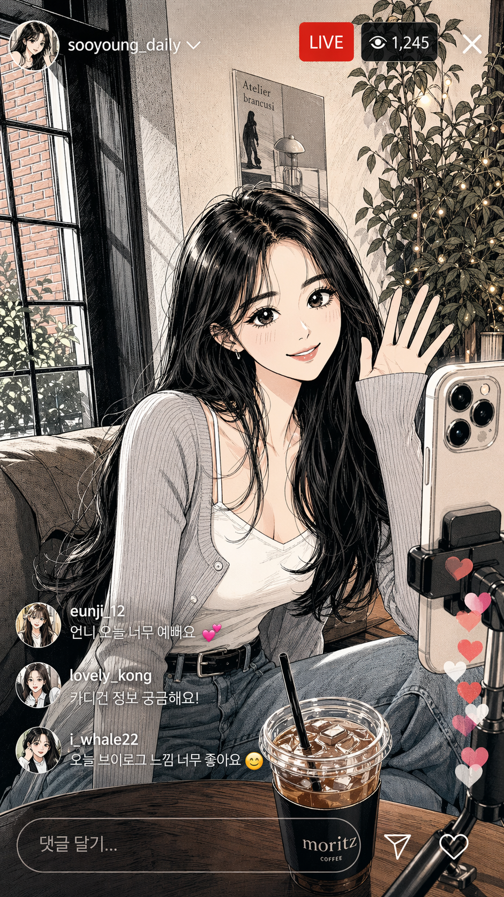
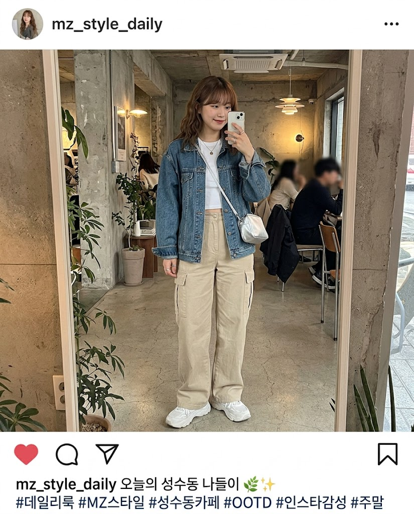

OpenAI has introduced **ChatGPT Images 2.0**, calling it **“a new era of image generation.”**

The obvious reading is simple: better pictures, better image quality, better creative output.

But that is probably the smaller story.

The more important question is what this kind of launch says about **ChatGPT itself**. OpenAI is no longer just adding features around a chatbot. It is steadily turning ChatGPT into a broader product surface — one that can write, reason, search, use tools, generate visuals, and keep more of the user’s work inside a single environment.

That is why this release matters.

## This is really a workflow story

If this were only an image model refresh, it would still matter. Image generation remains one of the most visible and competitive parts of the AI market.

But OpenAI’s direction now looks bigger than any one mode.

The company keeps moving toward the same goal: making ChatGPT the place where users can start a task, branch into different modes, and continue without leaving. Text, images, tools, memory, action, and iteration are being pulled closer together.

Seen that way, Images 2.0 is not just about visual output. It is about removing one more reason to leave ChatGPT.

That is a stronger product move than “our images got better.”

## Why that matters

AI products are starting to compete on something deeper than isolated quality.

They compete on **workflow gravity** — how many kinds of work they can keep inside one interface before the user feels the need to switch tools.

That is where a release like this becomes strategically important.

A user who can brainstorm, write, generate an image, revise it, change direction, and continue the rest of the work inside one product is not just using a better image generator. They are being trained into a more complete working environment.

That creates a different kind of advantage.

It is not only about output quality. It is about habit, convenience, and becoming the default place where work begins.

## A quick visual example

The examples below were generated in ChatGPT Images 2.0 from prompt variations around a Korean MZ-style female subject, including live-stream framing and comic-style transformations.

Even in a small example set, what stands out is not just raw visual quality. It is the ability to push the same underlying subject direction across multiple presentation modes — realistic, social-media framed, color comic, and sketch-like comic — without changing the broader intent of the prompt family.

That is exactly the kind of thing that matters when image generation is used as part of a workflow rather than as a one-off novelty.

## The Nano Banana comparison

This becomes clearer when you compare ChatGPT Images 2.0 with tools like **Nano Banana 2**.

Nano Banana 2 is often experienced more directly as an image tool. People talk about it in terms of fun, speed, style play, character consistency, and how usable the outputs feel in hands-on creative experimentation. In that sense, it competes closer to the “pure image workflow” layer.

By contrast, Nano Banana 2 can also feel more immediately native to social-image aesthetics — the kind of output that already looks like it belongs on an Instagram-style lifestyle feed.

That is where the difference becomes useful.

ChatGPT Images 2.0 feels strategically important because it makes image creation more native inside a larger assistant environment. Nano Banana 2 can feel stronger when the goal is immediacy, image-first play, or social-style output that already feels ready to post.

So the comparison is not only “which one makes the prettier image?” It is also “which one fits more naturally into the kind of workflow the user actually wants?”

That is the more interesting product question.

If you mainly want to explore visuals, iterate on looks, or play with image generation as its own medium, a tool like Nano Banana 2 may feel more immediate and more purpose-built.

If you want image generation as one step inside a broader chain of thinking, writing, planning, and execution, ChatGPT Images 2.0 may be more strategically important.

## The broader race is changing too

This matters because the competitive field is changing in the same direction.

Anthropic is pushing Claude beyond chat and into coding and design workflows. Google is widening Gemini across multimodal creation and developer tooling. Open-source tools keep getting better at specialized image and media generation.

So the real question is no longer just: who makes the best standalone image model?

It is: **who makes image creation feel like a natural part of a broader working system?**

That is where OpenAI may be aiming with ChatGPT Images 2.0.

## Why product integration often beats feature strength

There is a reason this kind of launch matters even before every technical detail is obvious.

A product does not have to win every benchmark to become the default choice. Sometimes it wins because it is the easiest place to stay.

That is especially true in creative work.

Users do not naturally want one tool for writing, another for images, another for revision, another for research, and another for action if one environment can cover most of it well enough.

If ChatGPT keeps absorbing these functions, then each individual improvement is doing more than upgrading a feature. It is strengthening the case that ChatGPT should be the user’s main workspace.

That is the bigger pattern.

## A note of caution

It is still worth being careful not to overread every launch.

Sometimes an image update is mostly an image update.

But with OpenAI, that explanation is becoming less convincing over time. Too many releases now point in the same direction: more native tools, more multimodal capability, more continuity across tasks, and more reasons for users to stay inside the same product.

That makes Images 2.0 harder to treat as a one-off creative update.

## Our take

The easiest interpretation of **ChatGPT Images 2.0** is that OpenAI improved image generation.

The better interpretation is that OpenAI keeps widening the role of ChatGPT itself.

And compared with a tool like Nano Banana 2, that difference becomes easier to see. Nano Banana 2 can win on immediacy, experimentation, or image-native creative feel. ChatGPT Images 2.0 is trying to win by making image creation one natural step inside a larger multimodal workflow.

If that continues, the long-term winner in AI image generation may not be the company with the prettiest standalone outputs.

It may be the company that makes image creation feel like the most natural next action inside everything else the user is already doing.

That is the bigger story behind ChatGPT Images 2.0.

## References

- OpenAI, *Introducing ChatGPT Images 2.0*  
  https://openai.com/index/introducing-chatgpt-images-2-0/
