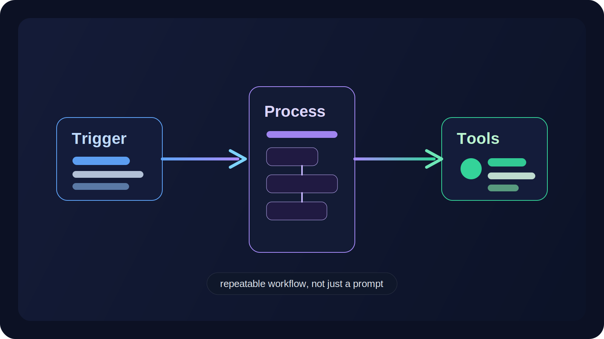
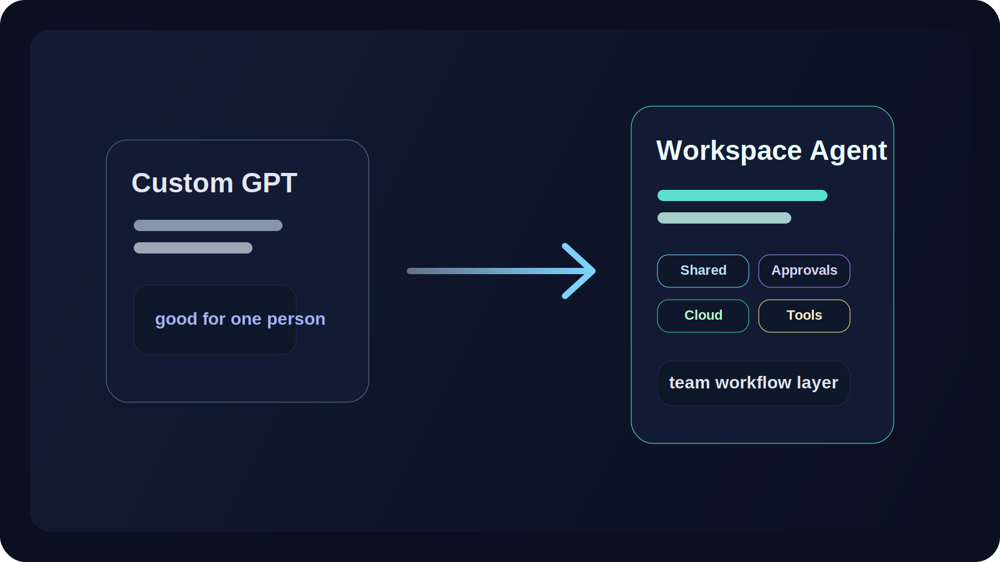
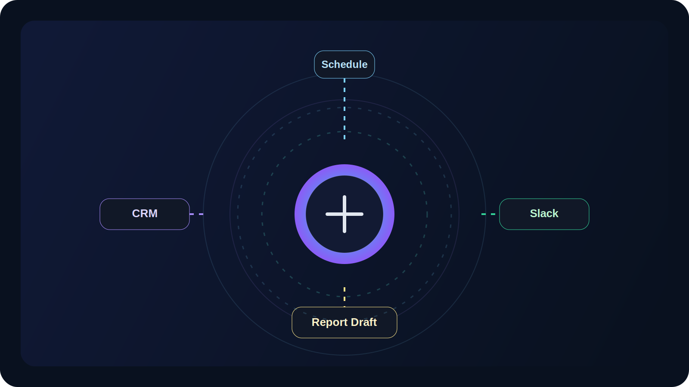

**Workspace agents** sound smaller than they are.

If you only see the name, it is easy to assume OpenAI added one more layer on top of ChatGPT: a stronger GPT, a few connectors, some automation, maybe a nicer builder.

That is not really what is happening.

What OpenAI is introducing is closer to a **shared agent layer for recurring team workflows inside ChatGPT**.[1] These agents run in the cloud, can keep working when no one is watching, connect to tools, and stop for approval when a step carries real risk.[1]

That puts them much closer to operations software than to a normal chat feature.

## The shortest explanation

OpenAI calls workspace agents an evolution of GPTs.[1]

That is true, but it still undersells the shift.

A custom GPT mostly feels like a personal assistant with some extra structure. A workspace agent is meant to be something a team can build once, share, reuse, and improve over time. OpenAI’s own description keeps coming back to the same ideas:[1][2]

- shared use across a team
- cloud execution
- connected tools and systems
- approvals and admin controls

Put differently, this is not just “ChatGPT, but better at answering.” It is ChatGPT being pushed toward **repeatable work**.

If a team wants help with weekly reporting, inbound triage, lead qualification, vendor review, or routine content preparation, this is the kind of product OpenAI is aiming at.[1]

## The best mental model is trigger + process + tools

The launch post explains the product, but OpenAI’s Academy guide explains the logic behind it.

There, the company breaks an agent into three parts:[2]

1. **Trigger** — what starts the work  
2. **Process and skills** — how the work gets done  
3. **Tools and systems** — what the agent is allowed to read from or act through

That is a better way to think about workspace agents than “smart prompt.”

OpenAI is describing something closer to a workflow system with a model in the middle. A workspace agent might start on a schedule, pull updates from Slack and a CRM, turn those into a draft, and then pause for approval before doing something sensitive.[1][2]

That is a different product shape from a one-off chat.

## What they are actually good for

OpenAI is fairly clear about the kind of work it has in mind.[2]

The company says agents fit best when the work is:

- repeatable
- structured
- time-based or event-driven
- tool-based

That filter is useful because it rules out a lot of hype.

Workspace agents are not the natural answer to every fuzzy thinking task. They make more sense when the same pattern keeps showing up and when there is a recognizable output on the other end.

OpenAI’s own examples reflect that.[1][2] They are not dream-journal prompts or open-ended ideation sessions. They are things like:

- briefings and reports
- triage and routing
- analysis and recommendations
- content drafting
- planning and coordination

So the center of gravity here is not raw creativity. It is **routine work with real inputs, handoffs, and rules**.

## Why this is different from normal ChatGPT use

A normal ChatGPT session is still mostly about a person asking for help in the moment. Even custom GPTs usually feel like a user-facing assistant with some extra instructions.

Workspace agents move in a different direction.

According to OpenAI, they can run longer workflows in the cloud, move across tools, ask for approval at sensitive moments, and be shared inside an organization under admin oversight.[1]

That matters because it changes the product boundary.

OpenAI also says GPTs will remain available while teams experiment with workspace agents, and that GPT-to-agent conversion will become easier later.[1] That makes the product split easier to read:

- **GPTs** look like the lighter prototype layer
- **workspace agents** look like the governed layer for ongoing use

That is more than a feature expansion. It is OpenAI sketching out a different role for ChatGPT.

## The real argument behind the launch

OpenAI’s case is basically that important work inside companies rarely lives inside one prompt.[1]

It usually depends on scattered context, internal process, multiple tools, approvals, and handoffs between people. That is where a lot of the friction sits.

Not in the final paragraph. In the surrounding mess:

- gathering inputs from different places
- checking whether the work follows the right process
- deciding when to escalate
- stopping before a risky action
- packaging the output so the next person can use it

Workspace agents are OpenAI’s attempt to bring that layer into ChatGPT.

## Governance is not a side feature

The easiest way to misread this launch is to focus only on cloud execution.

Yes, the cloud piece matters. But the deeper product story is governance.

OpenAI is making **approvals, permissions, sharing, analytics, and compliance visibility** part of the core agent story, not something teams bolt on later.[1]

The company says teams can choose what tools and data an agent can use, what actions it may take, and when it has to stop and ask first.[1] Admins can manage who gets to build, use, and share agents, and they can inspect configurations and runs through the Compliance API.[1]

That is a very different posture from “here is a smart assistant, good luck.”

It suggests OpenAI thinks workplace agents will be judged less by demo magic alone and more by whether they can behave predictably inside an organization.

## Not every workflow should become an agent

To OpenAI’s credit, its Academy guide is more restrained than the market around it.[2]

The guide explicitly says regular chat is still a better fit for open-ended brainstorming, exploratory writing, and one-off thinking.[2]

That limit matters.

Some work is still better handled by deterministic automation. Some work is too risky. Some looks repeatable until you hit the fifth ugly edge case. And some tasks are simply better when a human stays in direct control.

So the strongest reading is not that workspace agents replace ordinary software workflows.

It is that OpenAI sees them as a middle ground: **more structured than chat, less rigid than hard-coded automation**.

## Why this matters

Workspace agents matter because they show where ChatGPT is going next.

For a long time, ChatGPT’s center of gravity was the personal-assistant model: ask, answer, upload a file, maybe use a custom GPT.

Workspace agents point toward something broader.

OpenAI wants ChatGPT to become a place where teams define recurring work, connect tools, add rules and approvals, and let cloud agents keep that work moving.[1][2]

That is a much bigger product ambition than another feature in the sidebar.

It pushes ChatGPT toward a shared workflow runtime.

Whether teams fully buy into that model is still an open question. But the direction is hard to miss.

## Our take

The simplest description is still the best one:

**workspace agents are ChatGPT agents for repeatable team workflows.**

If GPTs mostly gave individuals a customizable assistant, workspace agents are meant to give organizations a reusable operator: something that can move across systems, pause for approval, and keep working after the original user steps away.

That is why this launch is worth paying attention to.

The feature list matters, but the larger signal is strategic. OpenAI is no longer just trying to sell a chatbot that sometimes uses tools. It is trying to sell **ChatGPT as a workplace agent layer**.

That is the bigger thing to watch.

## References

[1] OpenAI, *Introducing workspace agents in ChatGPT*  
https://openai.com/index/introducing-workspace-agents-in-chatgpt/

[2] OpenAI, *Workspace agents*  
https://openai.com/academy/workspace-agents/
